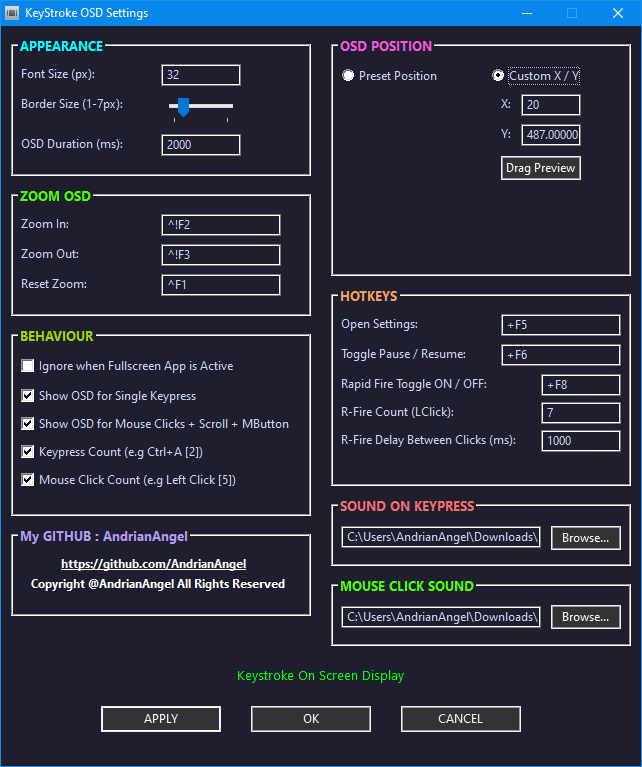
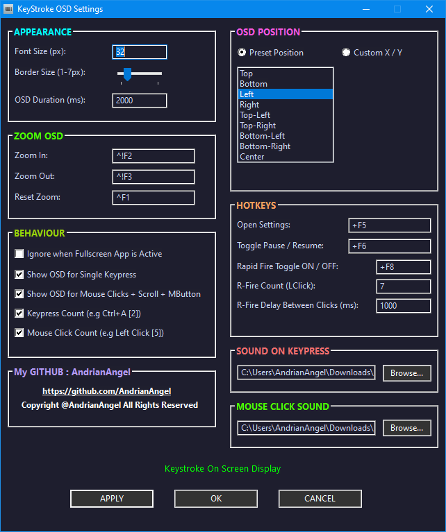
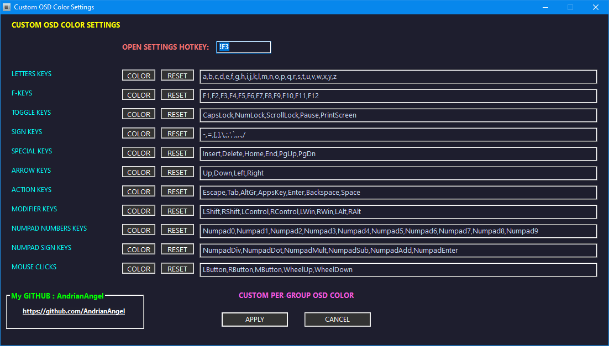
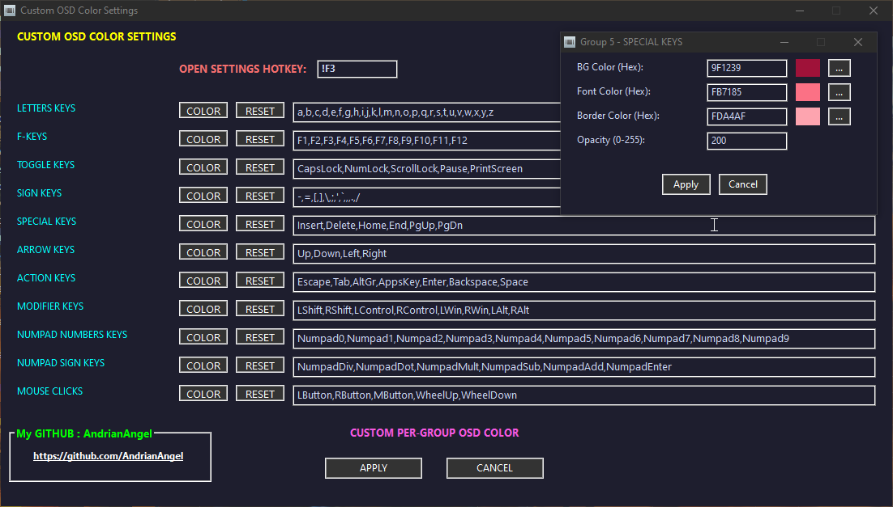
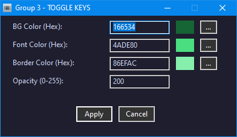
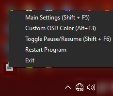
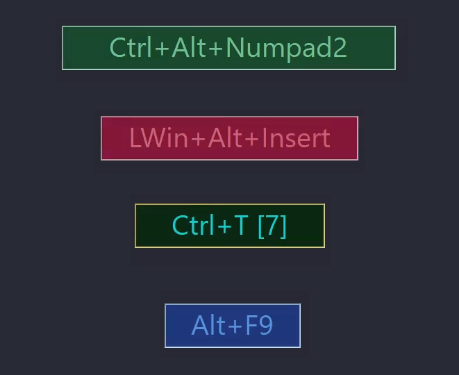
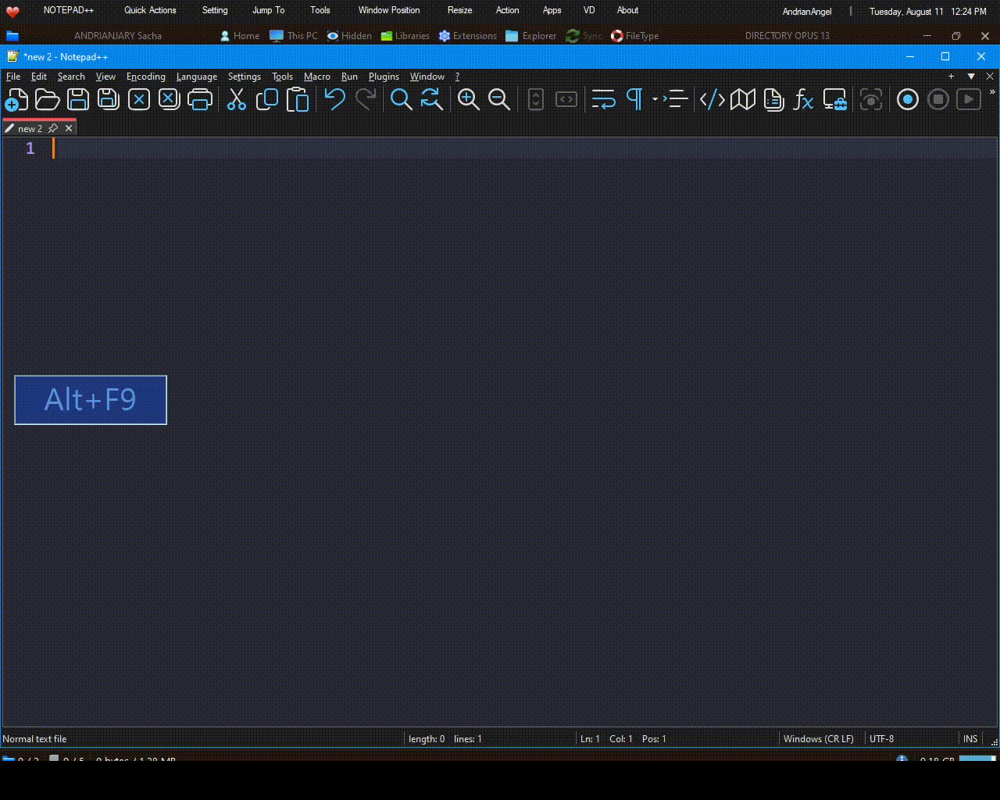
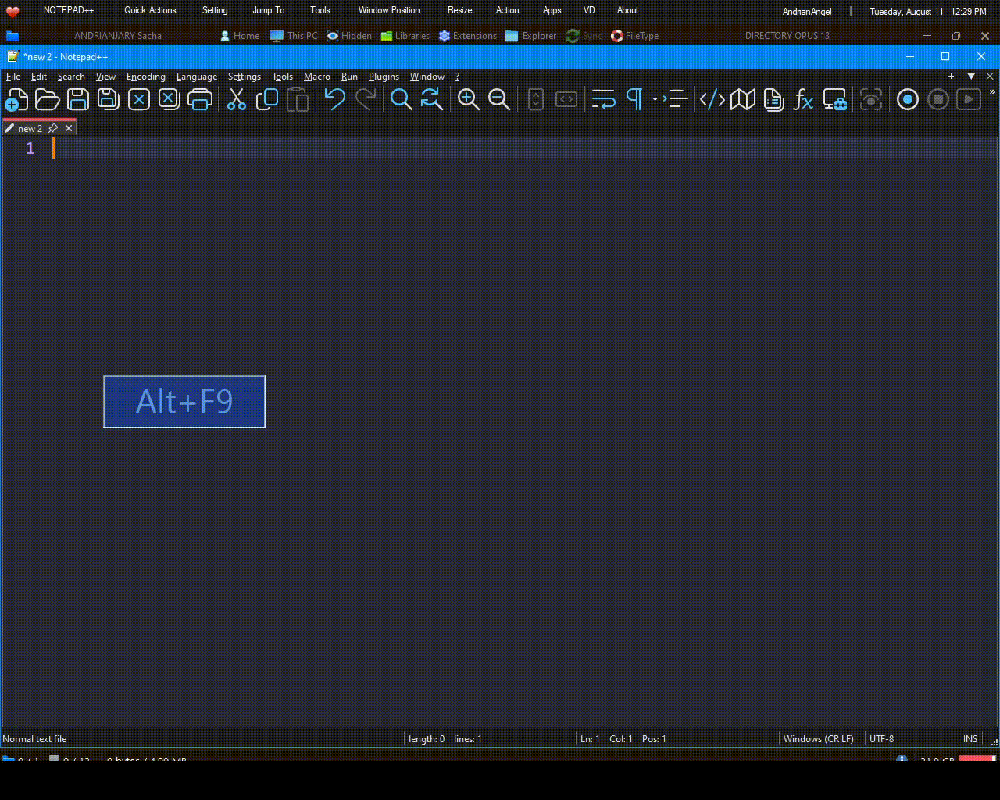

___

### ⌨️ FAST KEYSTROKE OSD 💻
___

### 🌞 OVERVIEW

**Fast Keystroke OSD** shows an on-screen display of your keystrokes and mouse clicks in real time — perfect for tutorials, streaming, screen recordings, and demos. Every key you press and every click you make appears instantly on screen, with a fully customizable window (position, color, font, size, opacity), preset and drag-to-position placement, per-key-group custom coloring, rapid-fire click simulation, keypress/click counters, live zoom controls, and sound feedback for keystrokes and mouse clicks.
___

## ♦️ MAIN SETTING (DRAG PREVIEW) & MAIN SETTING (PRESET POSITION)

  
  

**A** — Main settings panel with live drag preview, letting you position the OSD window anywhere on screen and see changes instantly.
**A1** — Main settings panel using preset position options (Top, Bottom, Left, Right, corners, Center) for quick, snap-to placement.
___

## 🚦 CUSTOM OSD COLOR SETTING & CUSTOM OSD COLOR SETTING + POPUP

  
  

**A2** — Custom OSD color settings panel, allowing background, font, and border colors to be assigned per key group.
**A4** — Custom OSD color settings shown together with the color popup open, for fine-tuning colors on the fly.
___

## 🖊️ COLOR POPUP + PICKER

A dedicated color picker popup for selecting precise background, font, and border colors for each custom key group.
___

## ✔️ TRAY MENU & OSD EXAMPLES

  
  

**A5** — Quick-access system tray menu for toggling the OSD, pausing/resuming, and opening settings without interrupting your workflow.
**A6** — Sample OSD displays showing different color themes and layouts in action.
___

### 🎥 WATCH DEMO
___

## ➕ KEYPRESS + CLICK

Live demo of keystrokes and mouse clicks being captured and displayed on screen in real time, with sound feedback.
___

## 🔧 PRESET POS + DRAG PREVIEW

Demo of switching between preset positions and using the drag preview to reposition the OSD window live.
___

## 📚 CUSTOM OSD COLOR SETTING

Demo of customizing OSD colors per key group and seeing the changes reflected instantly.
___

## 🔥 RAPID FIRE + OSD ZOOM

Demo of rapid-fire click simulation and live OSD zoom in/out/reset controls.
___

### 🎯 FEATURES
___

## 🔥 RAPID FIRE

Toggle Rapid Fire with a hotkey to auto-repeat left clicks on every manual click, at a configurable click count and delay between clicks (in milliseconds) — useful for testing, gaming, or any repetitive-click workflow. A tray notification confirms when Rapid Fire is turned on or off.
___

## 📚 CUSTOM OSD COLOR PER GROUP (PICKER + RESET BUTTON)

Assign a unique background, font, and border color to each key group (Letters, F-Keys, Toggle Keys, Sign Keys, Special Keys, Arrow Keys, Action Keys, Modifier Keys, Numpad Numbers, Numpad Signs, and Mouse Clicks) using a built-in color picker popup. A reset button restores any group back to its default color scheme at any time.
___

## 🔧 DRAG PREVIEW (POSITION) + PRESET

Position the OSD window exactly where you want it by dragging a live preview around the screen, or pick from ready-made presets — Top, Bottom, Left, Right, Top-Left, Top-Right, Bottom-Left, Bottom-Right, and Center — which automatically calculate placement based on your screen size.
___

## 🎨 APPEARANCE

Fine-tune how the OSD looks with controls for **border size** (outline thickness around the OSD window), **font size** (text size of displayed keys/clicks), and **OSD duration** (how long, in milliseconds, each keystroke/click stays visible before fading) — alongside window size, background color, opacity, and font family/color.
___

## 📌 ZOOM OSD (HOW IT WORKS)

Zoom in and out of the OSD text size on the fly using dedicated hotkeys, without opening the settings panel. Zooming in increases the font size in small steps, zooming out decreases it (down to a minimum size), and a reset hotkey instantly returns the OSD to its saved default font size. Each zoom action shows a temporary on-screen preview of the current size before it fades out.
___

## ✔️ ALL BEHAVIOR CHECKBOXES

- **Enabled** — turns the entire OSD system on/off.
- **Ignore Fullscreen** — hides the OSD while a fullscreen app/game is active.
- **Show Single Key** — displays individual keypresses, not just combos.
- **Show Mouse Keys** — includes mouse clicks in the OSD display.
- **Show Keypress Count** — displays a running count of repeated keypresses.
- **Show Mouse Click Count** — displays a running count of repeated mouse clicks.
- **Use Custom Position** — switches between manual X/Y coordinates and preset positions.
___

## ⌨️ MAIN HOTKEYS

| Action | Default Hotkey |
|---|---|
| Open Settings | `Shift + F5` |
| Pause / Resume OSD | `Shift + F6` |
| Toggle Rapid Fire | `Shift + F8` |
| Zoom In | `Ctrl + Alt + F2` |
| Zoom Out | `Ctrl + Alt + F3` |
| Zoom Reset | `Ctrl + F1` |
| Toggle Custom Colors | `Alt + F2` |
| Open Custom Color Settings | `Alt + F3` |

All hotkeys are fully customizable from the Settings panel.
___

### 🔰 DOWNLOAD

- **Fast_KeyStroke_OSD_26_08_12_V1.1.3.7_X64.exe** — Standalone compiled executable, ready to run.
- **Fast_KeyStroke_OSD_26_08_12_V1.1.3.7_X64.zip** — Zipped package containing the executable and required files.

### 🎙️ SOUND FILES

- **CSound.wav** — Sound effect played on mouse click.
- **keytyping.wav** — Sound effect played on keystroke.

___

Copyright: AndrianAngel (Github) ♥️ — All rights reserved.
